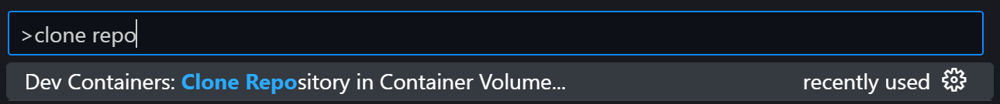

# MobiFlight Documentation

Documentation website for MobiFlight, written in [Hugo](https://gohugo.io/) with the [Hextra theme](https://imfing.github.io/hextra/docs/getting-started/).

The documentation is set up for editing using Visual Studio Code dev containers:

1. [Install VSCode](https://code.visualstudio.com/)
2. [Install Docker Desktop](https://docs.docker.com/get-started/introduction/get-docker-desktop/)
3. Install the [Dev Containers](https://marketplace.visualstudio.com/items?itemName=ms-vscode-remote.remote-containers) extension
4. Run VSCode
5. Hit `CTRL-SHIFT-P` and type `clone repo` to find the dev container command and select it: 

6. Enter this repo's URL (https://github.com/neilenns/mobiflight-docs)
7. Wait for the dev container to build

To view the documentation press `F5` and it will automatically build and open in Edge. To use Chrome instead select `Launch Chrome` in the run and debug tab.

## Style guidelines

## General conventions

- Filenames are in lowercase, spaces are replaced with hyphens (-).
- All Markdown files must pass markdownlint.
- Unordered lists use hyphens (-).
- Unordered lists have a period at the end of each sentence.
- Use GitHub alerts instead of Hextra callout shortcodes.
- Reference board and device images using cards (see the `boards/` and `devices/` pages for examples).
- Reference UI elements that users should click or interact with in **bold**.

### Screenshots

- Use `.png` format for all screenshots.
- Set width to 800px.
- Store in the `assets/screenshots` folder.
- Reference using the `{}` shortcode.
- The shortcode must have a title specified, and the title must end in a period.
- Take screenshots using the [Windows Snipping Tool](https://support.microsoft.com/en-us/windows/use-snipping-tool-to-capture-screenshots-00246869-1843-655f-f220-97299b865f6b) in `Window` mode, not `Freeform` mode.
- Clean up the rounded corners so a transparent background shows.

### Board and device images

- Use `.png` format for all board and device images.
- Set dimensions to 800x600.
- Store in the `assets/card-images` folder.
- Reference using the `{}` shortcode.

## Pinout diagrams

- Use `.svg` format for all pinout diagrams.
- Process the files using [svgomg](https://svgomg.net/) with the default options plus `Prefer viewBox to width/height` enabled.
- Store in the page bundle for the associated board and name the file `pinout.svg`.
- Reference using the `{}` shortcode.
