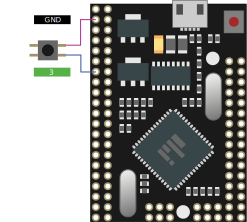
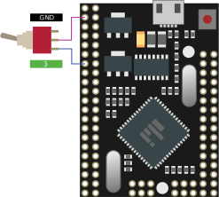
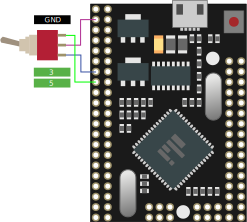

The following components are required to wire a button or switch:

- The button or switch.




Two position switches have one outer leg connected to a board pin and the middle leg connected to GND. The second outer leg is left unconnected.




Two position switches have one outer leg connected to a board pin and the middle leg connected to GND. The second outer leg is left unconnected.




Three position switches have both outer legs connected to separate board pins and the middle leg connected to GND.




