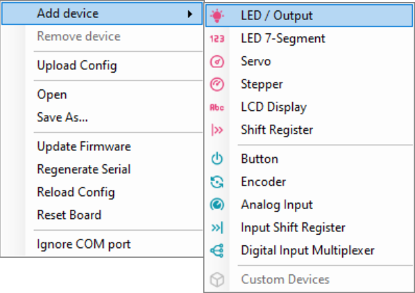
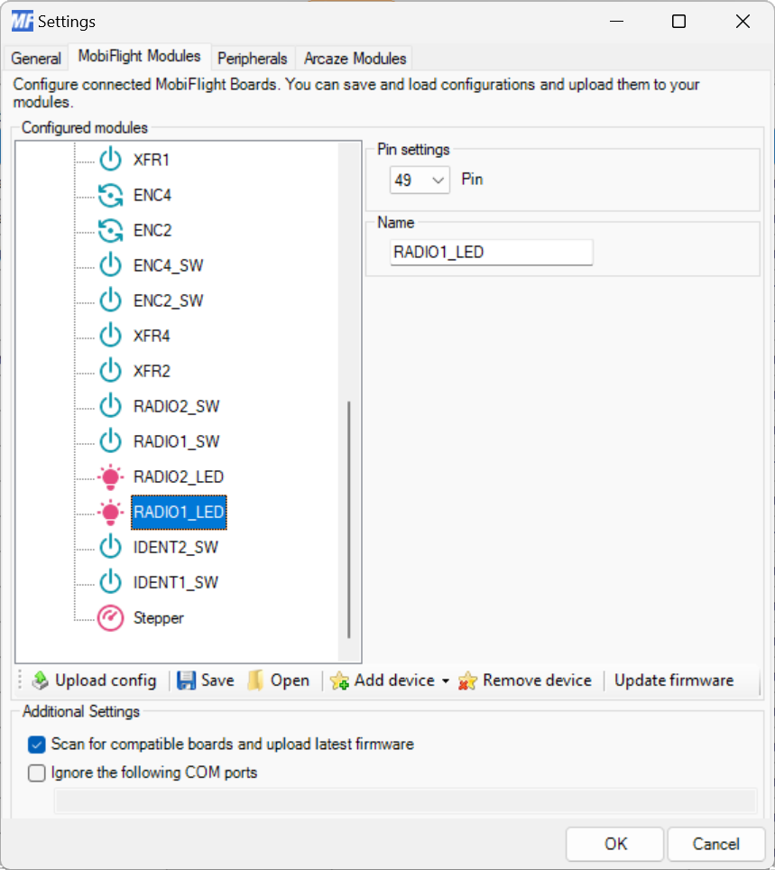
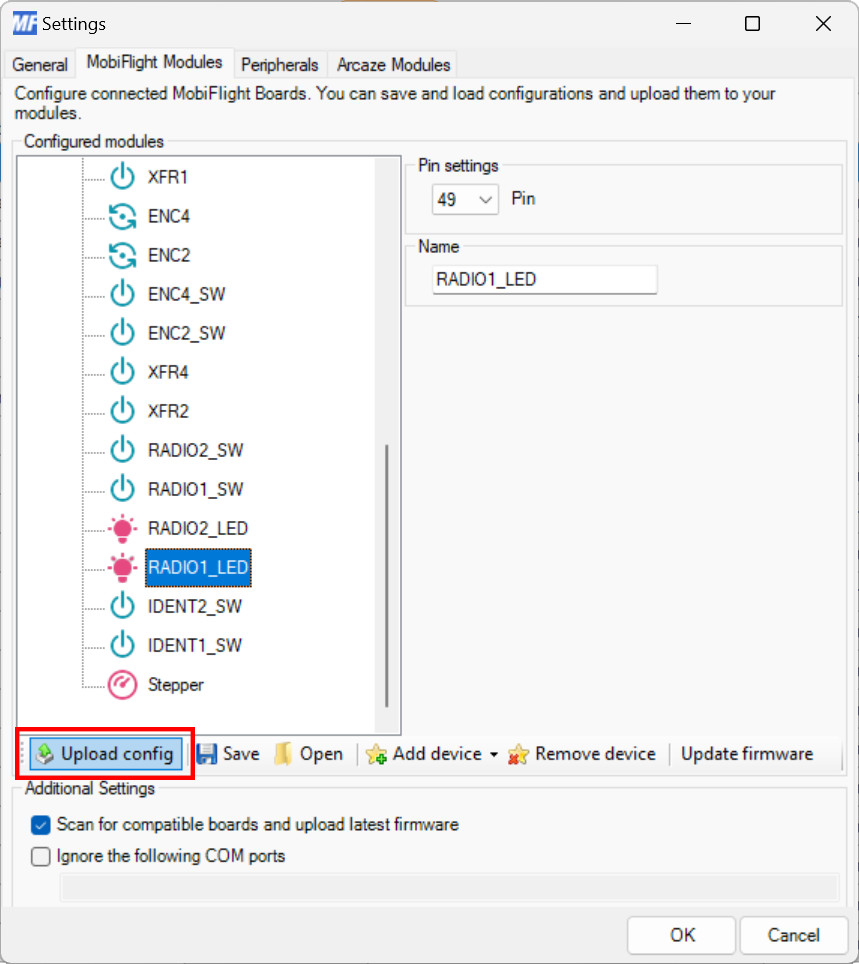

{}

### Open the MobiFlight Modules dialog

Click on the **MobiFlight Modules** button in the main window toolbar.

### Add the LED

Right click on the board the LED is connected to, select **Add Module** then **LED / Output**.

### Configure the LED pin

Use the **Pin settings** dropdown to specify the board pin the LED is connected to. Use the **Name** field to give
the LED a meaningful name. This name is shown in the output configuration screens when assigning a flight simulator
value to the LED.

### Upload the changes to the board

Click the **Upload config** button at the bottom of the **MobiFlight Modules** tab to upload the modified
configuration to the board.

### Close the MobiFlight modules dialog

Click the Ok button to close the MobiFlight modules dialog and return to the main app window.

{}
