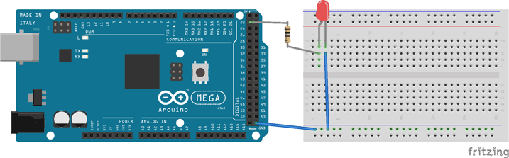

## Wiring

The following components are required to wire an LED:

- The LED
- A resistor, typically 220Ω

Connect the anode end of the LED (usually the longer leg) to the resistor, then connect the resistor to one of the digital pins of your board and the cathode end (usually the shorter leg) to GND.

